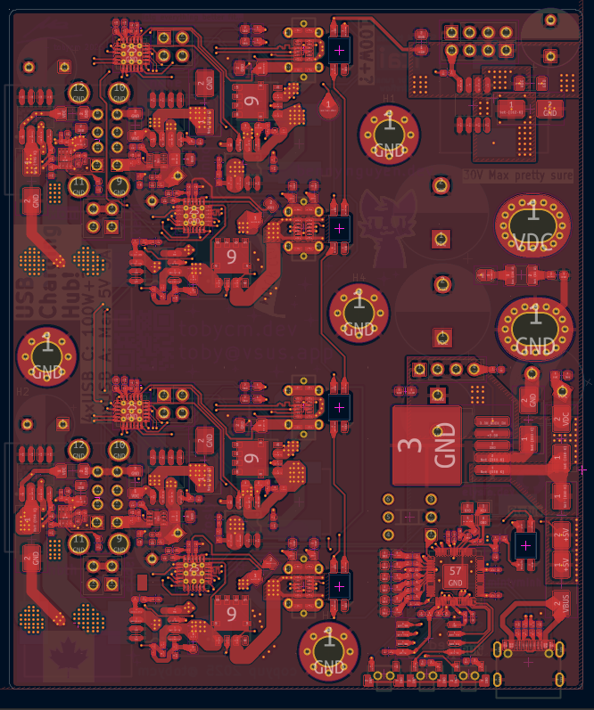
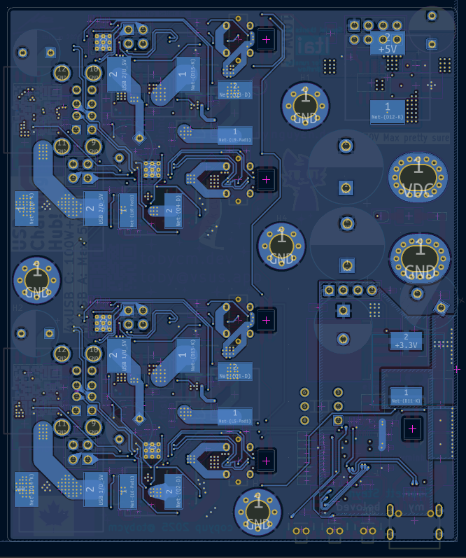
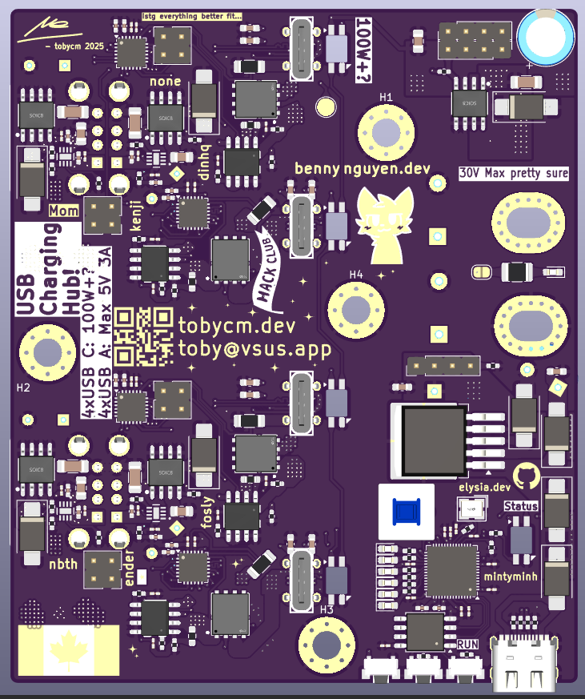
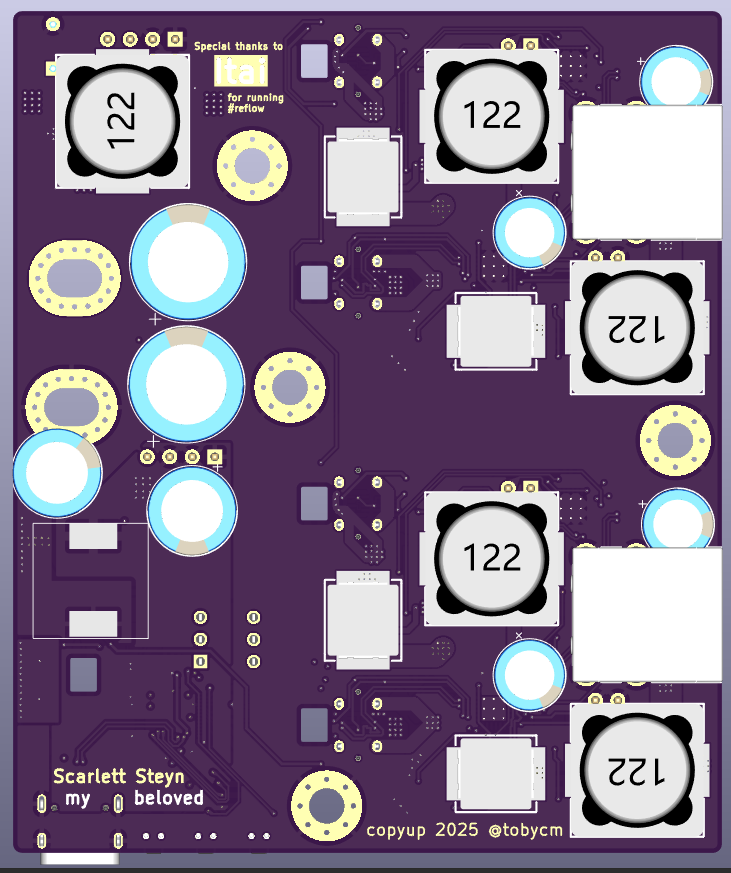

# usb charging hub!!

a 400W+ capable usb charging hub that takes in 22-36V DC input. equipped with a rp2040 and smart usb pd controllers, they can be much more capable than just 400W, and could really slurps power.

pcb is well made with amble trace width to prevent heating up from high current nets. compact layout of parts also let it be able to stay under 100x100mm pcb size.

pcb spec:

- size: 80x96mm
- 1oz/ft^2
- 4 layers

featuring:

- 4 usb c ports capable of 5A output
- 4 usb a ports capable of 3A output
- support for legacy charging protocols for all ports
- neopixels per port to indicate status
- mounting holes to... mount the pcb

was it fun to find parts? no, usb pd source ics are hell

was it fun to do the schematic? hell no

was it fun to layout the parts? heck no

was it fun to route everything? 😔😔😔😔😔

## Front layer:

## Back layer:

## Front 3D render:

## Back 3D render:

